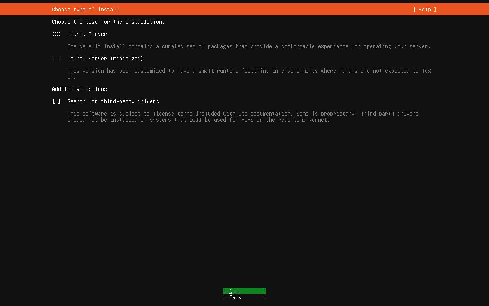
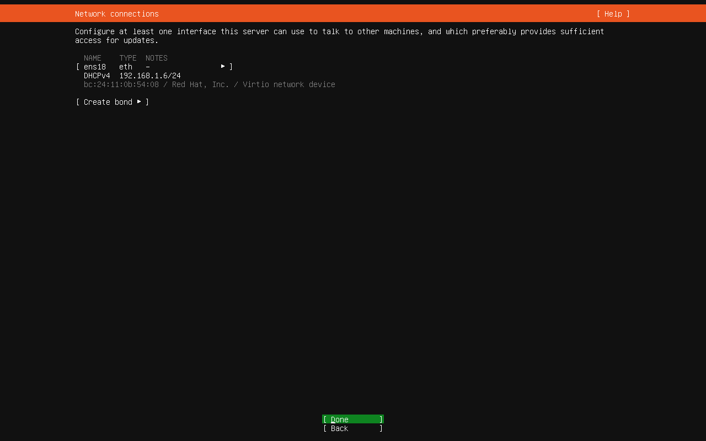
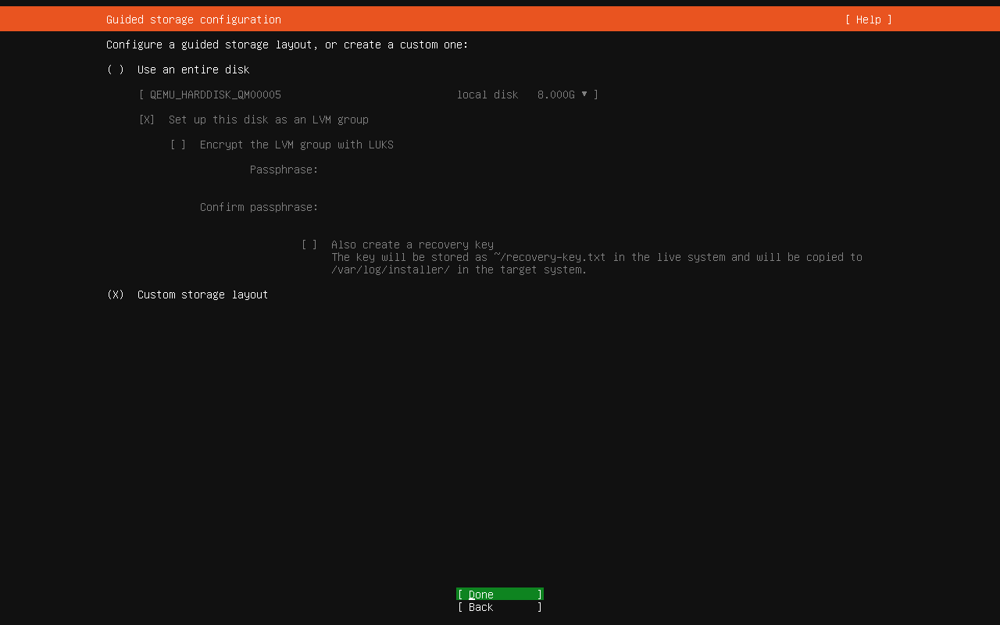
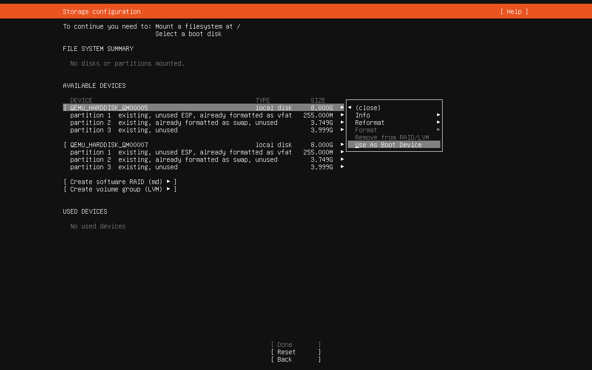
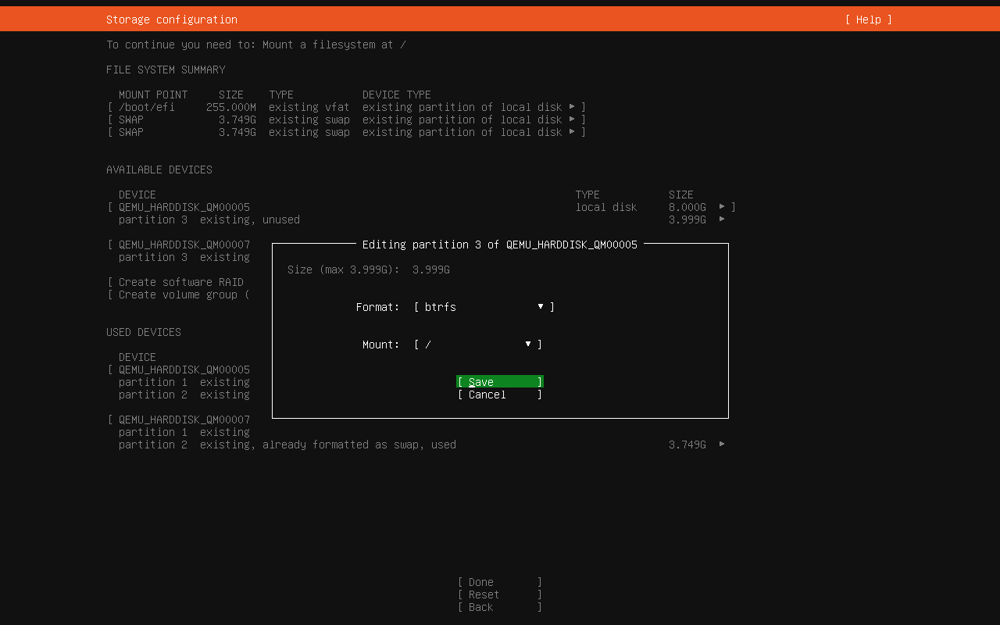
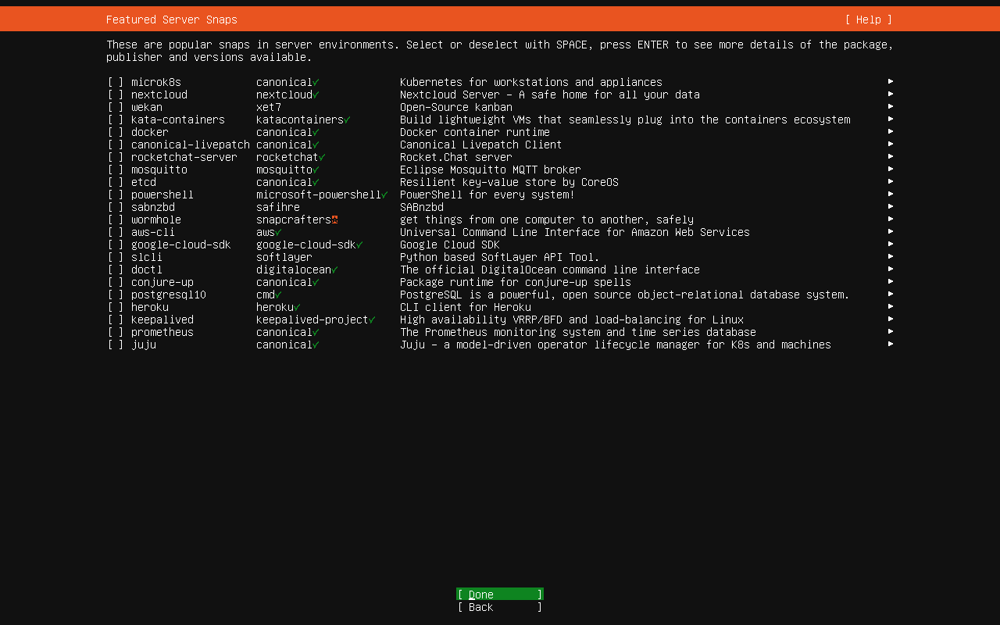
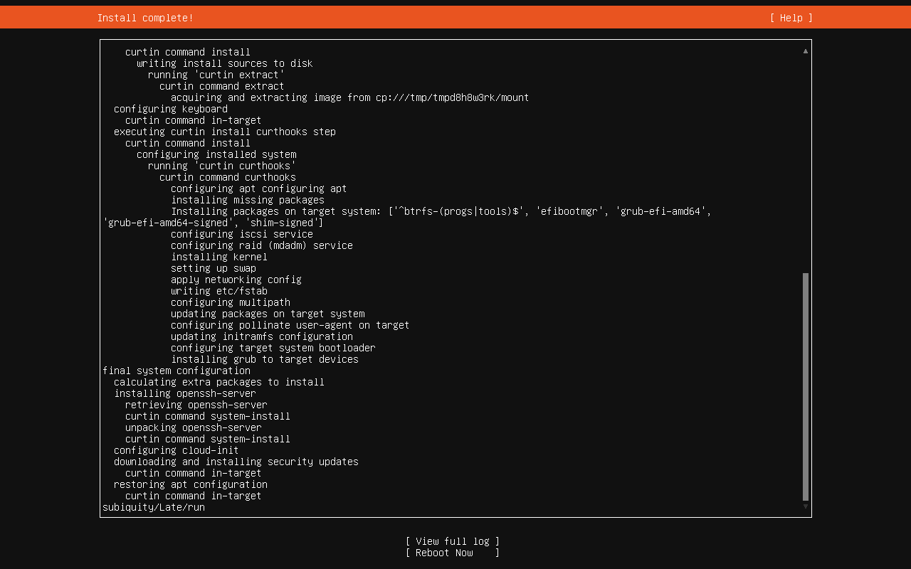

# Ubuntu Server 23.10をBtrfs (RAID 1)でセットアップ
## ストレージをフォーマット
### GNU GRUB画面

Try or Install Ubuntu Serverにフォーカスを当てて、Enterキーを押下する。

### Welcome!画面

Englishにフォーカスを当てて、Enterキーを押下する。

### Keyboard configuration画面

Layout、VariantともにJapaneseを選択したうえで、Doneにフォーカスを当ててEnterキーを押下する。

### Choose type of install画面

なにもせずに、Ctrl + Alt + F2キーを押下して、コンソール画面に入る。

### コンソール画面
以下のようにスクリプトによってインストール先のストレージ2台をフォーマットする。
```
sudo apt install git
git clone --depth=1 https://github.com/hydratlas/tips
cd tips/debian-and-ubuntu-tips/install-ubuntu-with-btrfs

lsblk -f -e 7
```
lsblkコマンドでインストール先のsdX（sda、sdb…）がなにかを確認し、以下のコマンドの1回目および2回目の引数に指定する
```
sudo bash -x btrfs1.sh sdX
sudo bash -x btrfs1.sh sdX

sudo poweroff
```
最後に再起動する。

## インストール
### GNU GRUB画面

Try or Install Ubuntu Serverにフォーカスを当てて、Enterキーを押下する。

### Welcome!画面

Englishにフォーカスを当てて、Enterキーを押下する。

### Keyboard configuration画面

Layout、VariantともにJapaneseを選択したうえで、Doneにフォーカスを当ててEnterキーを押下する。

### Choose type of install画面

Ubuntu Serverを選択したうえで、Doneにフォーカスを当ててEnterキーを押下する。

### Network connections画面

自動的にDHCPによってIPアドレスが取得されるため、それを少し待ってからDoneにフォーカスを当ててEnterキーを押下する。

### Configure proxy画面

なにもせずに、Doneにフォーカスを当ててEnterキーを押下する。

### Configure Ubuntu archive mirror画面

自動的にミラーが取得されるため、それを少し待ってからDoneにフォーカスを当ててEnterキーを押下する。

### Guided storage configuration画面

Custom storage layoutを選択したうえで、Doneにフォーカスを当ててEnterキーを押下する。

### Storage configuration画面

1台目のストレージにフォーカスを当ててEnterキーを押下すると、サブメニューが表示される。その中からUse As Boot Deviceにフォーカスを当ててEnterキーを押下する。


2台目のストレージにフォーカスを当ててEnterキーを押下すると、サブメニューが表示される。その中からAdd As Another Boot Deviceにフォーカスを当ててEnterキーを押下する。


1台目のストレージのpartition 2にフォーカスを当ててEnterキーを押下すると、「Editing partition 2」というポップアップウィンドウが表示される。「Use as swap」にチェックを入れたうえで、Saveにフォーカスを当ててEnterキーを押下する。


2台目のストレージのpartition 2にフォーカスを当ててEnterキーを押下すると、「Editing partition 2」というポップアップウィンドウが表示される。「Use as swap」にチェックを入れたうえで、Saveにフォーカスを当ててEnterキーを押下する。


1台目のストレージのpartition 3にフォーカスを当ててEnterキーを押下すると、「Editing partition 3」というポップアップウィンドウが表示される。「Fremat」は「Btrfs」、「Mount」は「/」を選択したうえで、Saveにフォーカスを当ててEnterキーを押下する。


「FILE SYSTEM SUMMARY」を確認する。今回の場合、/のbtrfsパーティションはこの場でフォーマットする。/boot/efiのvfatパーティション、および2つのswapパーティションはすでにフォーマット済みのためフォーマットせずに、既存の状態のまま使用する。確認したら、Doneにフォーカスを当ててEnterキーを押下する。


フォーマットによりデータが失われるという警告が表示される。Continueにフォーカスを当ててEnterキーを押下する。

### Profile setup画面

任意の値を入力してから、Doneにフォーカスを当ててEnterキーを押下する。

### SSH Setup画面

「Install OpenSSH server」にチェックを入れ、「from GitHub」を選択し、ユーザー名を入力してから、Doneにフォーカスを当ててEnterキーを押下する。


SSHキーを確認してから、Yesにフォーカスを当ててEnterキーを押下する。

### Features Server Snaps画面

必要なものがあればそれらにチェックを入れてから、Doneにフォーカスを当ててEnterキーを押下する。なお、ここでインストールできるのはSnap版のアプリケーションであるが、例えば一般的にDockerはSnap版ではないものをインストールする。

### Installing system画面

インストールが始まるため、待つ。

### Install complete!画面

インストールが終わったら、Ctrl + Alt + F2キーを押下して、コンソール画面に入る。

### コンソール画面
以下のようにスクリプトによってBtrfsをRAID 1にするとともに、Snapperに対応したサブボリュームのレイアウトにし、さらにfstabとブートローダーをそれに合わせた構成に更新する。
```
sudo apt install git
git clone --depth=1 https://github.com/hydratlas/tips
cd tips/debian-and-ubuntu-tips/install-ubuntu-with-btrfs

lsblk -f -e 7
```
lsblkコマンドで/targetのsdX（sda、sdb…）がなにかを確認し、以下のコマンドで/targetのsdXを1番目の引数、/targetではないsdXを2番目の引数に指定する。
```
sudo bash -eux btrfs2.sh sdX sdX

sudo poweroff
```
終わったら再起動する。
