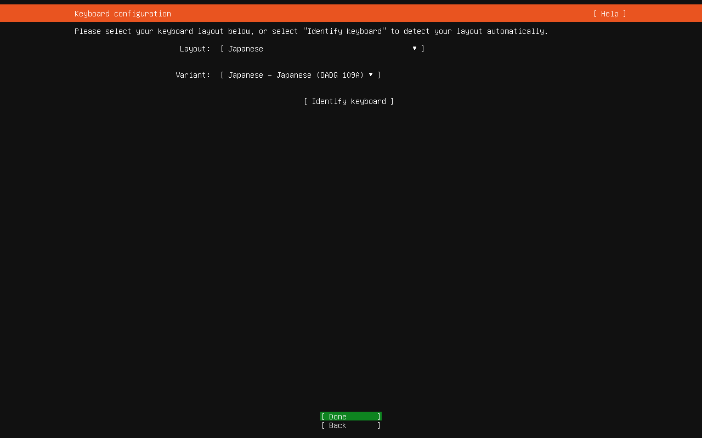
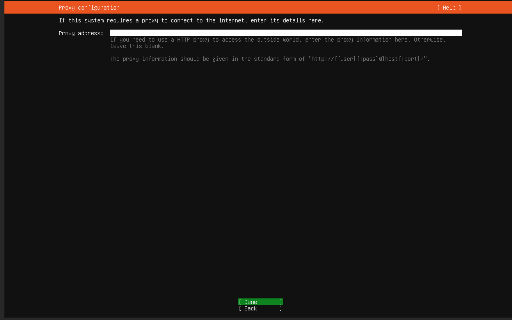

# Ubuntu Server 24.04をBtrfs (RAID 1)でセットアップ
## ストレージをフォーマット
### GNU GRUB画面


「Try or Install Ubuntu Server」を選択して、Enterキーを押下する。

### Welcome!画面


「English」を選択して、Enterキーを押下する。

### Installer update available画面


「Update to the new installer」を選択して、Enterキーを押下する。なお、インストーラーのアップデートが存在しない場合、この画面はスキップされる。

### Keyboard configuration画面


Layoutは「Japanese」、Variantは「Japanese」を選択したうえで、Doneにフォーカスを当ててEnterキーを押下する。

### Choose the type of installation画面


なにもせずに、Ctrl + Alt + F2キーを押下して、コンソール画面に入る。

### コンソール画面
以下のようにスクリプトによってインストール先のストレージ2台をフォーマットする。

まず、スクリプトをダウンロードして、そのディレクトリーに移動する。
```sh
sudo apt install -y git
git clone --depth=1 https://github.com/hydratlas/tips
cd tips/debian-and-ubuntu-tips/install-ubuntu-with-btrfs
```

lsblkコマンドでインストール先のストレージの名前（sdX）を確認する。
```sh
lsblk -f -e 7
```

インストール先のストレージを、スクリプトによってフォーマットする。
```sh
sudo bash -x btrfs1.sh sdX
sudo bash -x btrfs1.sh sdX
```

最後に、Ctrl + Alt + F1キーを押下して、インストーラー画面に戻る。

## インストール
### Choose the type of installation画面


Ubuntu Serverを選択したうえで、Doneにフォーカスを当ててEnterキーを押下する。

### Network configuration画面


自動的にDHCPによってIPアドレスが取得されるため、それを少し待ってからDoneにフォーカスを当ててEnterキーを押下する。

### Configure proxy画面


なにもせずに、Doneにフォーカスを当ててEnterキーを押下する。

### Configure Ubuntu archive mirror画面


自動的にミラーが取得されるため、それを少し待ってからDoneにフォーカスを当ててEnterキーを押下する。

### Guided storage configuration画面


Custom storage layoutを選択したうえで、Doneにフォーカスを当ててEnterキーを押下する。

### Storage configuration画面


1台目のストレージにフォーカスを当ててEnterキーを押下するとサブメニューが表示される。その中からUse As Boot Deviceにフォーカスを当ててEnterキーを押下する。


2台目のストレージにフォーカスを当ててEnterキーを押下するとサブメニューが表示される。その中からUse As Boot Deviceにフォーカスを当ててEnterキーを押下する。


1台目のストレージのpartition 2にフォーカスを当ててEnterキーを押下するとサブメニューが表示される。その中からEditにフォーカスを当ててEnterキーを押下する。


「Editing partition 2」というポップアップウィンドウが表示される。「Use as swap」にチェックを入れたうえで、Saveにフォーカスを当ててEnterキーを押下する。


2台目のストレージのpartition 2にフォーカスを当ててEnterキーを押下するとサブメニューが表示される。その中からEditにフォーカスを当ててEnterキーを押下する。


「Editing partition 2」というポップアップウィンドウが表示される。「Use as swap」にチェックを入れたうえで、Saveにフォーカスを当ててEnterキーを押下する。


1台目のストレージのpartition 3にフォーカスを当ててEnterキーを押下するとサブメニューが表示される。その中からEditにフォーカスを当ててEnterキーを押下する。


「Editing partition 3」というポップアップウィンドウが表示される。「Fremat」は「btrfs」、「Mount」は「/」を選択したうえで、Saveにフォーカスを当ててEnterキーを押下する。


「FILE SYSTEM SUMMARY」を確認する。今回の場合、/のbtrfsパーティションはこの場でフォーマットする。/boot/efiのvfatパーティション、および2つのswapパーティションはすでにフォーマット済みのためフォーマットせずに、既存の状態のまま使用する。確認したら、Doneにフォーカスを当ててEnterキーを押下する。


フォーマットによりデータが失われるという警告が表示される。Continueにフォーカスを当ててEnterキーを押下する。

### Profile configuration画面


任意の値を入力してから、Doneにフォーカスを当ててEnterキーを押下する。

### Upgrade to Ubuntu Pro画面


continueにフォーカスを当ててEnterキーを押下する。

### SSH Setup画面


「Install OpenSSH server」にチェックを入れ、「Import SSH Key」にフォーカスを当ててEnterキーを押下する。


「from GitHub」を選択し、ユーザー名を入力してから、Doneにフォーカスを当ててEnterキーを押下する。


インポートするSSHキーを確認して、Yesにフォーカスを当ててEnterキーを押下する。


Doneにフォーカスを当ててEnterキーを押下する。

### Features Server Snaps画面


必要なものがあればそれらにチェックを入れてから、Doneにフォーカスを当ててEnterキーを押下する。なお、ここでインストールできるのはSnap版のアプリケーションであるが、例えば一般的にDockerはSnap版ではないものをインストールする。

### Installing system画面


インストールが始まるため、待つ。

### Installation complete!画面


インストールが終わったら、Ctrl + Alt + F2キーを押下して、コンソール画面に入る。

### コンソール画面
lsblkコマンドでインストール先のストレージの名前（sdX）を確認する。
```sh
lsblk -f -e 7
```

インストール先のストレージを、スクリプトによってBtrfsをRAID 1にするとともに、Snapperに対応したサブボリュームのレイアウトにし、さらにfstabとブートローダーをそれに合わせた構成に更新する。ただし、1台だけ指定した場合には、RAID 1ではなくシングル構成にする。第一引数のストレージから第二引数のストレージにコピーしてRAID 1構成にするため、引数の順番には注意すること。
```sh
sudo bash -eux btrfs2.sh sdX sdX
```

終わったら再起動する。
```sh
sudo reboot
```
