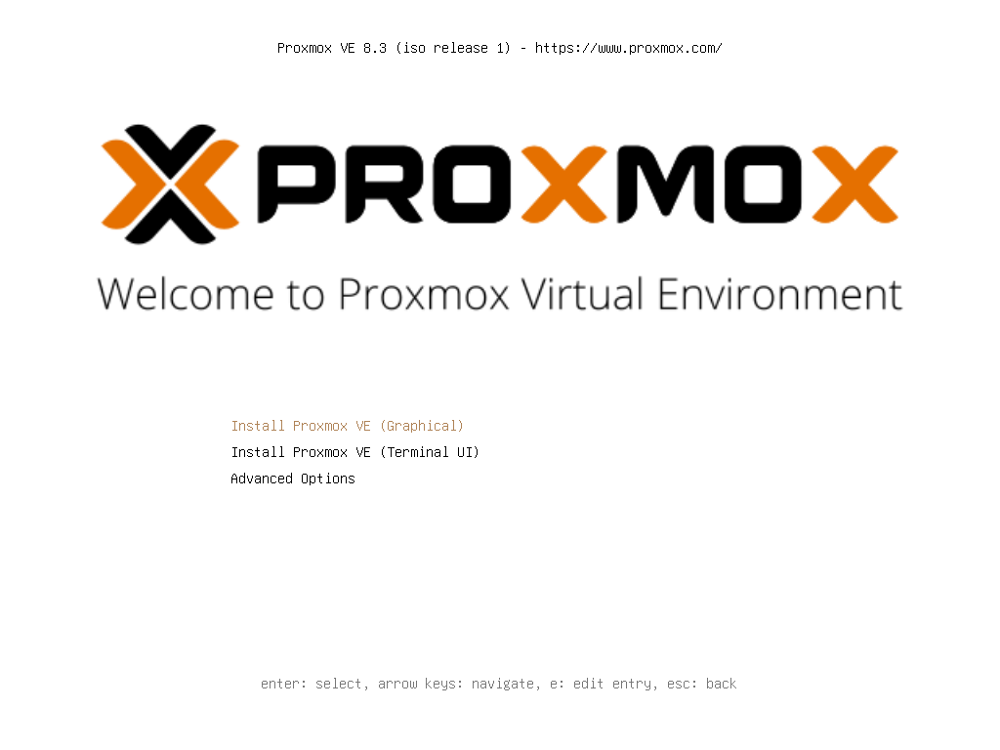
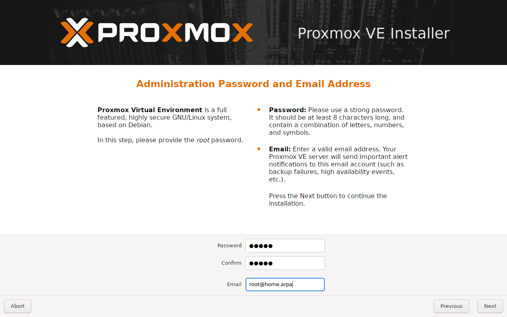
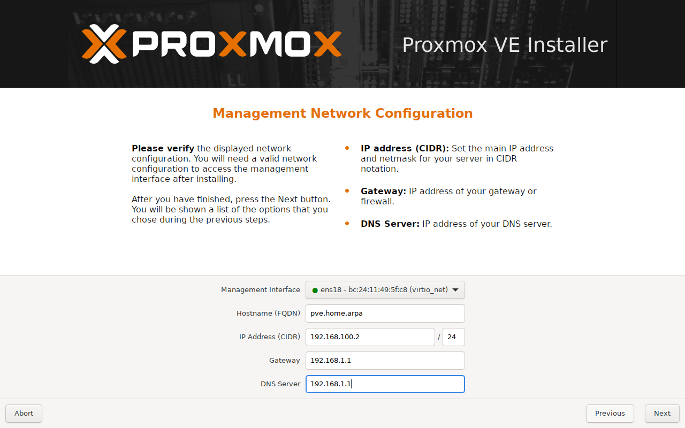

# Proxmox VE 8.3のインストール
## Welcome to Proxmox Virtual Environment

「Install Proxmox VE (Graphical)」を選択して、Enterキーを押下する。

## END USER LICENSE AGREEMENT (EULA)

「I agree」ボタンをクリックする。

## Proxmox Virtual Environment (PVE)

「Options」ボタンをクリックする。

## Harddisk options / Disk Setup

Filesystemは「zfs (RAID1)」を選択、Harddisk 0とHarddisk 1はそれぞれに対して使用するストレージを選択する。選択し終わったら、「Advanced Options」タブをクリックする。

## Harddisk options / Advanced Options

compressは「zstd」を選択する。ARC max sizeは適正な値を入力する。適正な値はストレージの1TBあたり1GiBが目安で（4TBのRAID 1の場合4GiB）、上限は搭載している物理メモリの3/4もしくは、1GBを残した全部である。

ほかはデフォルトのままで、ashiftは「12」、checksumは「on」、copiesは「1」とする。hdsizeは自動的に最大値が設定されるため、特別な事情がなければその値で構わない。

入力および選択し終わったら、「OK」ボタンをクリックする。

## Proxmox Virtual Environment (PVE)

「Next」ボタンをクリックする。

## Location and Time Zone selection

Countryは「Japan」、Timezoneは「Asia/Tokyo」、Keyboard layoutは「Japanese」と入力または選択して、「Next」ボタンをクリックする。

## Administration Password and Email Address

Root passwordおよびConfirmは任意の値を入力する。Emailは「root@home.arpa」とダミーアドレスを入力する。

## Management Network Configuration

- Management interfaceは任意のインターフェースを選択
- Hostname (FQDN)は「\<hostname\>.home.arpa」を入力（\<hostname\>部分は任意の値）
- IP address (CIDR)は任意の値
- Gateway addressは任意の値
- DNS server addressは任意の値

入力および選択し終わったら、「Next」ボタンをクリックする。

## Summary

これまでインストールの設定を行ってきた内容が表示される。内容を確認して、「Install」ボタンをクリックする。

## Virtualization Platform

インストールには時間がかかる。

## Installation successful!

インストールが終わったら、数秒で自動的に再起動する。
