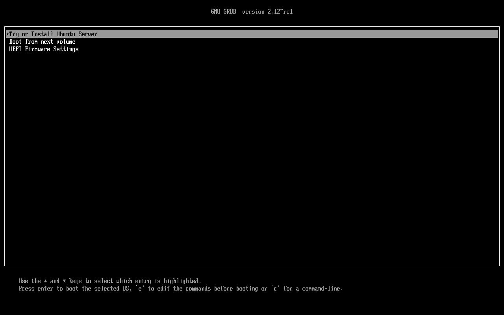
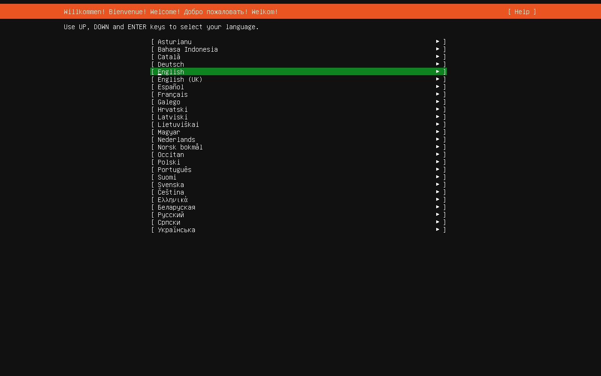
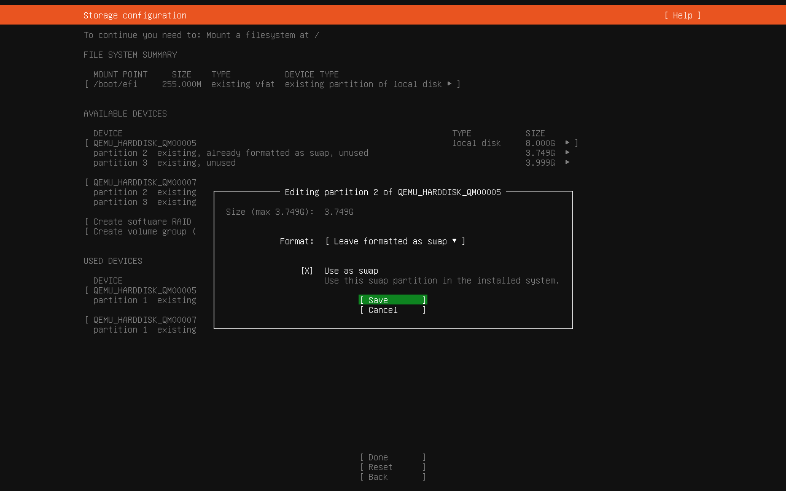
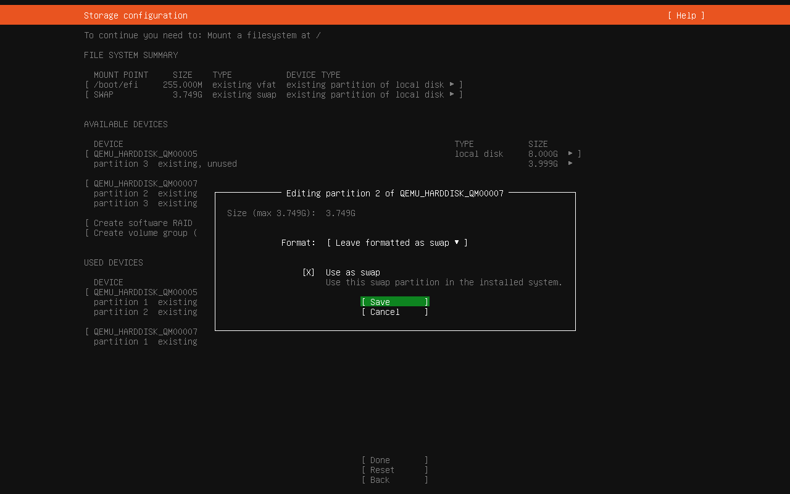
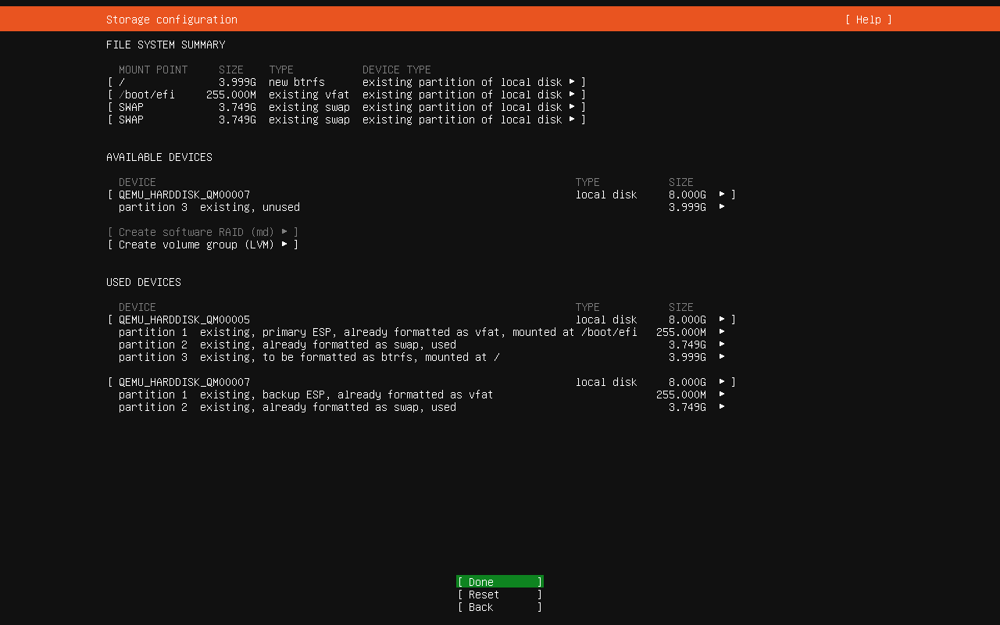
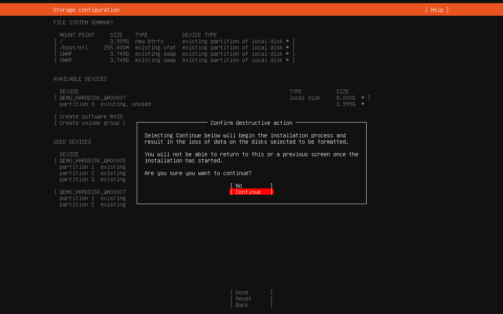
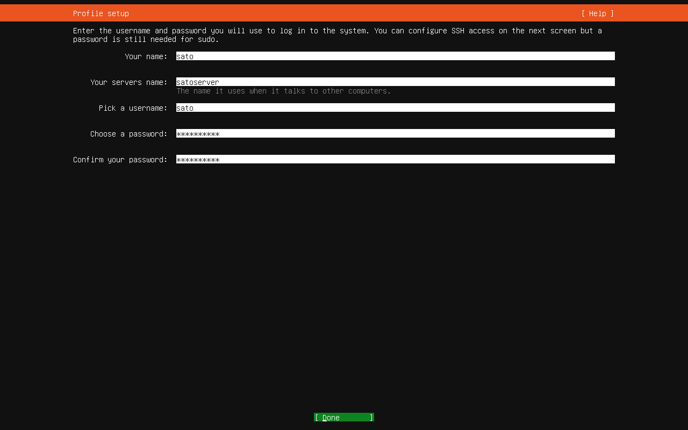
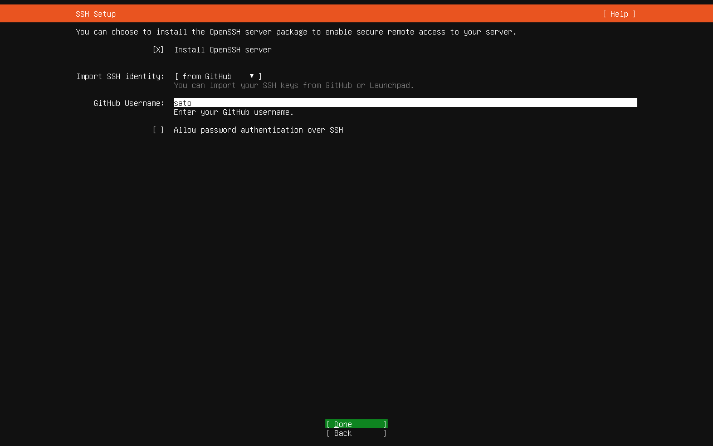

# Ubuntu Server 22.04をBtrfs (RAID 1) + Snapper + grub-btrfsでセットアップ
## ストレージをフォーマット
### GNU GRUB画面

Try or Install Ubuntu Serverにフォーカスを当てて、Enterキーを押下する。

### Welcome!画面

Englishにフォーカスを当てて、Enterキーを押下する。

### Keyboard configuration画面

Layout、VariantともにJapaneseを選択したうえで、Doneにフォーカスを当ててEnterキーを押下する。

### Choose type of install画面

なにもせずに、Ctrl + Alt + F2キーを押下して、コンソール画面に入る。

### コンソール画面
以下のようにスクリプトによってインストール先のストレージ2台をフォーマットして、最後に再起動する。
```
wget https://raw.githubusercontent.com/hydratlas/tips/main/install-ubuntu/btrfs1.sh
chmod a+x btrfs1.sh
lsblk -f -e 7 # インストール先のsdXがなにかを確認し、1回目および2回目の引数に指定する
sudo bash -x btrfs1.sh sdX
sudo bash -x btrfs1.sh sdX
sudo shutdown -r now
```

## インストール
### GNU GRUB画面

Try or Install Ubuntu Serverにフォーカスを当てて、Enterキーを押下する。

### Welcome!画面

Englishにフォーカスを当てて、Enterキーを押下する。

### Keyboard configuration画面

Layout、VariantともにJapaneseを選択したうえで、Doneにフォーカスを当ててEnterキーを押下する。

### Choose type of install画面

Ubuntu Serverを選択したうえで、Doneにフォーカスを当ててEnterキーを押下する。

### Network connections画面

自動的にDHCPによってIPアドレスが取得されるため、それを少し待ってからDoneにフォーカスを当ててEnterキーを押下する。

### Configure proxy画面

なにもせずに、Doneにフォーカスを当ててEnterキーを押下する。

### Configure Ubuntu archive mirror画面

自動的にミラーが取得されるため、それを少し待ってからDoneにフォーカスを当ててEnterキーを押下する。

### Guided storage configuration画面

Custom storage layoutを選択したうえで、Doneにフォーカスを当ててEnterキーを押下する。

### Storage configuration画面

1台目のストレージにフォーカスを当ててEnterキーを押下すると、サブメニューが表示される。その中からUse As Boot Deviceにフォーカスを当ててEnterキーを押下する。


2台目のストレージにフォーカスを当ててEnterキーを押下すると、サブメニューが表示される。その中からAdd As Another Boot Deviceにフォーカスを当ててEnterキーを押下する。


1台目のストレージのpartition 2にフォーカスを当ててEnterキーを押下すると、「Editing partition 2」というポップアップウィンドウが表示される。「Use as swap」にチェックを入れたうえで、Saveにフォーカスを当ててEnterキーを押下する。


2台目のストレージのpartition 2にフォーカスを当ててEnterキーを押下すると、「Editing partition 2」というポップアップウィンドウが表示される。「Use as swap」にチェックを入れたうえで、Saveにフォーカスを当ててEnterキーを押下する。


1台目のストレージのpartition 3にフォーカスを当ててEnterキーを押下すると、「Editing partition 3」というポップアップウィンドウが表示される。「Fremat」は「Btrfs」、「Mount」は「/」を選択したうえで、Saveにフォーカスを当ててEnterキーを押下する。


「FILE SYSTEM SUMMARY」を確認する。今回の場合、/のbtrfsパーティションはこの場でフォーマットする。/boot/efiのvfatパーティション、および2つのswapパーティションはすでにフォーマット済みのためフォーマットせずに、既存の状態のまま使用する。確認したら、Doneにフォーカスを当ててEnterキーを押下する。


フォーマットによりデータが失われるという警告が表示される。Continueにフォーカスを当ててEnterキーを押下する。

### Profile setup画面

任意の値を入力してから、Doneにフォーカスを当ててEnterキーを押下する。

### SSH Setup画面

「Install OpenSSH server」にチェックを入れ、「from GitHub」を選択し、ユーザー名を入力してから、Doneにフォーカスを当ててEnterキーを押下する。


SSHキーを確認してから、Yesにフォーカスを当ててEnterキーを押下する。

### Features Server Snaps画面

必要なものがあればそれらにチェックを入れてから、Doneにフォーカスを当ててEnterキーを押下する。なお、ここでインストールできるのはSnap版のアプリケーションであるが、例えば一般的にDockerはSnap版ではないものをインストールする。

### Installing system画面

インストールが始まるため、待つ。

### Install complete!画面

インストールが終わったら、Ctrl + Alt + F2キーを押下して、コンソール画面に入る。

### コンソール画面
以下のようにスクリプトによってBtrfsをRAID 1にするとともに、Snapperに対応したサブボリュームのレイアウトにし、さらにfstabとブートローダーをそれに合わせた構成に更新する。終わったら再起動する。
```
wget https://raw.githubusercontent.com/hydratlas/tips/main/install-ubuntu/btrfs2.sh
chmod a+x btrfs2.sh
lsblk -f -e 7 # /targetのsdXがなにかを確認し、/targetのsdXを1番目の引数、/targetではないsdXを2番目の引数に指定する
sudo bash -x btrfs2.sh sdX sdX
sudo shutdown -r now
```

## インストール後に起動してからの設定
### 【オプション】mDNSのインストール
LAN内にDNSサーバーがない場合、mDNSをインストールすると「ホスト名.local」でSSH接続できるようになる。
```
sudo apt-get install -y avahi-daemon
```

## SSHから設定
### 【オプション】ノートパソコンのふたをしめてもサスペンドしないようにする
```
sudo perl -p -i -e 's/^#?HandleLidSwitch=.+$/HandleLidSwitch=ignore/g;' /etc/systemd/logind.conf &&
sudo systemctl restart systemd-logind.service
```

### スクラブ・バランスタイマーの設定・確認
設定。
```
sudo apt-get install -y btrfsmaintenance &&
sudo perl -p -i -e 's/^OnCalendar=.+$/OnCalendar=fri/g;' /lib/systemd/system/btrfs-balance.timer &&
sudo perl -p -i -e 's/^OnCalendar=.+$/OnCalendar=sat/g;' /lib/systemd/system/btrfs-scrub.timer &&
sudo systemctl enable --now btrfs-balance.timer &&
sudo systemctl enable --now btrfs-scrub.timer
```

確認。
```
sudo systemctl status btrfs-balance.timer
sudo systemctl status btrfs-scrub.timer
```

### Snapperのインストールと設定・確認
インストールと設定。
```
sudo apt-get install -y snapper &&
sudo umount /.snapshots &&
sudo rm -d /.snapshots &&
sudo snapper -c root create-config / &&
sudo btrfs subvolume delete /.snapshots &&
sudo mkdir -p /.snapshots &&
sudo mount -a &&
sudo perl -p -i -e 's/^TIMELINE_LIMIT_YEARLY=.+$/TIMELINE_LIMIT_YEARLY="0"/g;' /etc/snapper/configs/root &&
sudo systemctl enable --now snapper-timeline.timer &&
sudo systemctl enable --now snapper-cleanup.timer
```

確認。
```
sudo systemctl status snapper-timeline.timer
sudo systemctl status snapper-cleanup.timer

sudo btrfs subvolume list /
sudo snapper -c root list
```

### grub-btrfsのインストールと設定
インストールと設定。
```
sudo apt-get install -y gawk inotify-tools git make bzip2 &&
cd ~/ &&
git clone https://github.com/Antynea/grub-btrfs.git &&
cd grub-btrfs &&
sudo make install &&
cd ../ &&
rm -drf grub-btrfs &&
sudo systemctl enable --now grub-btrfsd.service
```

確認。
```
sudo systemctl status grub-btrfsd.service
```

### btrfs-compsizeのインストールと使用
Btrfsの圧縮機能でどの程度ファイルが圧縮されたのかを表示する。

インストール。
```
sudo apt-get install -y btrfs-compsize
```

表示。
```
sudo compsize -x /
```
